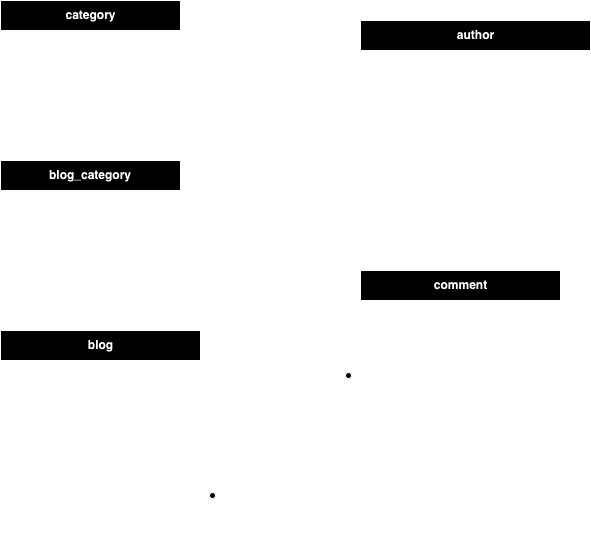

# Django Models

## เรามาออกแบบ models สำหรับ web application blog posts กัน

ด้านล่างนี้คือ ER diagram ของ web application blog posts



เรามาเริ่มจากการสร้าง project Django ใหม่กันก่อนนะครับ

ยังจำขั้นตอนที่ได้เรียนไปในสัปดาห์ก่อนได้ไหม ด้านล่างคือ command ที่จำเป็น 

### Create virtual environment
```sh
# Create project folder
> mkdir my_projects

# Create a virtual environment (Windows)
> py -m venv myvenv

# Activate virtual environment (Windows)
> myvenv\Scripts\activate.bat

# Create a virtual environment (MacOS)
> python -m venv myvenv

# Activate virtual environment (MacOS)
> source myvenv/bin/activate
```

### Install Django & start a new project **"myblogs"**

```sh
# Install Django
> pip install django

# Create project "myblogs"
> django-admin startproject myblogs

# Create the "blogs" app
> python manage.py startapp blogs

# Start server
> python manage.py runserver
```

จากนั้นทำการติดตั้ง Postgres Client `psycopg2`

```python
> pip install psycopg2
OR
> pip install psycopg2-binary
OR
> brew install postgresql # for MacOS
```

จากนั้นไปทำการตั้งค่าใน `myblogs/settings.py`

**HINT: ไปสร้่าง DB ใน postgres ก่อนนะครับ สร้าง DB ชื่อ "blogs"**

```python
# Database setting
DATABASES = {
    "default": {
        "ENGINE": "django.db.backends.postgresql",
        "NAME": "blogs",
        "USER": "db_username",
        "PASSWORD": "password",
        "HOST": "localhost",
        "PORT": "5432",
    }
}

# Add app blogs to INSTALLED_APPS
INSTALLED_APPS = [
    "django.contrib.admin",
    "django.contrib.auth",
    "django.contrib.contenttypes",
    "django.contrib.sessions",
    "django.contrib.messages",
    "django.contrib.staticfiles",
    # Add your apps here
    "blogs",
]
```

จากนั้นไปทำการสร้าง models ต่างๆ ให้เหมือนตามใน ER diagram ด้านบนกันเลย

เริ่มจาก `Author` และ `Category`

เพิ่ม code นี้ใน `blogs/models.py`

```python
from django.db import models


class Author(models.Model):
    first_name = models.CharField(max_length=150)
    last_name = models.CharField(max_length=200)
    email = models.CharField(max_length=150)

    def __str__(self):
        return f"{self.first_name} {self.last_name}"


class Category(models.Model):
    name = models.CharField(max_length=100)

    def __str__(self):
        return self.name
```

ลองสั่ง command: makemigrations เพื่อให้ Django ทำการสร้างไฟล์ migration ขึ้นมา

```sh
> python manage.py makemigrations
Migrations for 'blogs':
  blogs/migrations/0001_initial.py
    - Create model Author
    - Create model Category
```

จะเห็นว่ามีไฟล์ `blogs/migrations/0001_initial.py` ถูกสร้างขึ้นใน folder `/blogs/migrations/` เรามาลองดูในไฟล์กัน

```python
from django.db import migrations, models


class Migration(migrations.Migration):
    initial = True

    dependencies = []

    operations = [
        migrations.CreateModel(
            name="Author",
            fields=[
                (
                    "id", # Django จะทำการสร้าง field id ให้อัตโนมัติเป็น primary key + auto increment
                    models.BigAutoField(
                        auto_created=True,
                        primary_key=True,
                        serialize=False,
                        verbose_name="ID",
                    ),
                ),
                ("first_name", models.CharField(max_length=150)),
                ("last_name", models.CharField(max_length=200)),
                ("email", models.CharField(max_length=150)),
            ],
        ),
        migrations.CreateModel(
            name="Category",
            fields=[
                (
                    "id", # Django จะทำการสร้าง field id ให้อัตโนมัติเป็น primary key + auto increment
                    models.BigAutoField(
                        auto_created=True,
                        primary_key=True,
                        serialize=False,
                        verbose_name="ID",
                    ),
                ),
                ("name", models.CharField(max_length=100)),
            ],
        ),
    ]
```

ทีนี้เรามาลองเพิ่ม model `Blog` และ `Comment` กัน เพิ่ม code นี้ในไฟล์ `/blogs/models.py`

```python
class Blog(models.Model):
    title = models.CharField(max_length=100)
    content = models.TextField()
    like = models.IntegerField(default=0)
    created_by = models.ForeignKey("blogs.Author", on_delete=models.PROTECT)
    created_date = models.DateTimeField(auto_now_add=True)
    categories = models.ManyToManyField("blogs.Category")
    # https://docs.djangoproject.com/en/5.0/topics/db/examples/many_to_many/

    def __str__(self):
        return f"{self.title} ({self.like})"

class Comment(models.Model):
    comment = models.CharField(max_length=200)
    comment = models.ForeignKey("blogs.Blog", on_delete=models.CASCADE)
    created_date = models.DateTimeField(auto_now_add=True)
```

ทำการ makemigrations อีกครั้ง

ลองเช็คใน `/blogs/migrations/` จะเห็นว่ามีไฟล์ `0002_blog_comment.py` ถูกสร้างขึ้น เรามาลองดูในไฟล์กัน

```python
from django.db import migrations, models
import django.db.models.deletion


class Migration(migrations.Migration):
    dependencies = [
        ("blogs", "0001_initial"),
    ]

    operations = [
        migrations.CreateModel(
            name="Blog",
            fields=[
                (
                    "id",
                    models.BigAutoField(
                        auto_created=True,
                        primary_key=True,
                        serialize=False,
                        verbose_name="ID",
                    ),
                ),
                ("title", models.CharField(max_length=100)),
                ("content", models.TextField()),
                ("like", models.IntegerField(default=0)),
                ("created_date", models.DateTimeField(auto_now_add=True)),
                ("categories", models.ManyToManyField(to="blogs.category")), # M2M relationship ไปที่ตาราง category
                (
                    "created_by", # FK ไปที่ตาราง author
                    models.ForeignKey(
                        on_delete=django.db.models.deletion.PROTECT, to="blogs.author"
                    ),
                ),
            ],
        ),
        migrations.CreateModel(
            name="Comment",
            fields=[
                (
                    "id",
                    models.BigAutoField(
                        auto_created=True,
                        primary_key=True,
                        serialize=False,
                        verbose_name="ID",
                    ),
                ),
                ("comment", models.CharField(max_length=200)),
                ("created_date", models.DateTimeField(auto_now_add=True)),
                (
                    "blog", # FK ไปที่ตาราง blog
                    models.ForeignKey(
                        on_delete=django.db.models.deletion.CASCADE, to="blogs.blog"
                    ),
                ),
            ],
        ),
    ]
```

เพื่อทำการสั่งใน Django สร้าง table ใน database จากไฟล์ migrations ใช้ command

```sh
> python manage.py migrate
Operations to perform:
  Apply all migrations: admin, auth, blogs, contenttypes, sessions
Running migrations:
  Applying contenttypes.0001_initial... OK
  Applying auth.0001_initial... OK
  Applying admin.0001_initial... OK
  Applying admin.0002_logentry_remove_auto_add... OK
  Applying admin.0003_logentry_add_action_flag_choices... OK
  Applying contenttypes.0002_remove_content_type_name... OK
  Applying auth.0002_alter_permission_name_max_length... OK
  Applying auth.0003_alter_user_email_max_length... OK
  Applying auth.0004_alter_user_username_opts... OK
  Applying auth.0005_alter_user_last_login_null... OK
  Applying auth.0006_require_contenttypes_0002... OK
  Applying auth.0007_alter_validators_add_error_messages... OK
  Applying auth.0008_alter_user_username_max_length... OK
  Applying auth.0009_alter_user_last_name_max_length... OK
  Applying auth.0010_alter_group_name_max_length... OK
  Applying auth.0011_update_proxy_permissions... OK
  Applying auth.0012_alter_user_first_name_max_length... OK
  Applying blogs.0001_initial... OK
  Applying blogs.0002_blog_comment... OK
  Applying sessions.0001_initial... OK
```

เรามาลองเปิดดูตารางจริงๆ ใน database กัน จะเห็นว่ามีตารางถูกสร้างขึ้นตามที่เรากำหนดใน `models.py`
```python
- blogs_author
- blogs_blog
- blogs_blog_categories # เป็นตารางกลางที่ถูกสร้างขึ้นจาก M2M relationship ที่เรากำหนดไว้ระหว่างตาราง blog และ category
- blogs_category
- blog_comment
```

**TIPS: ประวัติการ apply migrations จะถูกบันทึกในตาราง `django_migrations`**

ลองเปิดเข้าไปดูสิว่ามี record การ apply `blogs/migrations/0001_initial.py` และ `blogs/migrations/0002_blog_comment.py` ไหม

## Model fields ที่ใช้บ่อยๆ

[Doc](https://docs.djangoproject.com/en/5.0/ref/models/fields/)

### Fields types

- BooleanField(**options)
- CharField(max_length=None, **options)
- EmailField(max_length=254, **options)
- URLField(max_length=200, **options)
- UUIDField(**options)
- TextField(**options)
- DateField(auto_now=False, auto_now_add=False, **options)

    - auto_now = True คือจะบันทึกค่า datetime.now() ทุกครั้งที่มีการแก้ไขค่า (INSERT + UPDATE)
    - auto_now_add = True คือจะบันทึกค่า datetime.now() ตอนที่สร้างใหม่ (INSERT)

- DateTimeField(auto_now=False, auto_now_add=False, **options)
- TimeField(auto_now=False, auto_now_add=False, **options)
- FileField(upload_to='', storage=None, max_length=100, **options)

    - upload_to คือกำหนด path ที่จะ save file

```python
class MyModel(models.Model):
    # file will be uploaded to MEDIA_ROOT/uploads
    upload = models.FileField(upload_to="uploads/")
    # or...
    # file will be saved to MEDIA_ROOT/uploads/2015/01/30
    upload = models.FileField(upload_to="uploads/%Y/%m/%d/")
```

- ImageField(upload_to=None, height_field=None, width_field=None, max_length=100, **options)

    - สืบทอด attributes และ methods ทั้งหมดจาก `FileField`
    - ทำการ validate ให้ว่าเป็น object ของ image ที่เหมาะสม และ สามารถกำหนด `height_field` และ `width_field`

- DecimalField(max_digits=None, decimal_places=None, **options)

```python
models.DecimalField(max_digits=5, decimal_places=2)
```

- IntegerField(**options)

    - ค่าตั้งแต่ -2147483648 ถึง 2147483647 รองรับใน database ทุกตัวที่ supported โดย Django.

- PositiveIntegerField(**options)
- JSONField(encoder=None, decoder=None, **options)

### Field options

- primary_key: ถ้ามีค่าเป็น True คือ column นี้เป็น primary key ของ table (ถ้าไม่กำหนด Django จะสร้าง column ชื่อ `id` ให้อัตโนมัติเป็น primary key)
- unique: ถ้ามีค่าเป็น True คือ ค่าใน column นี้ห้ามซ้ำ
- null: ถ้ามีค่าเป็น True คือ column นี้มีค่าเป็น null ได้
- blank: ถ้ามีค่าเป็น True คือ column นี้มีค่าเป็น "" หรือ empty string ได้
- default: กำหนดค่า default
- choices: กำหนด ENUM ให้เลือกเฉพาะค่าที่กำหนด

```python
from django.db import models


class Student(models.Model):
    FRESHMAN = "FR"
    SOPHOMORE = "SO"
    JUNIOR = "JR"
    SENIOR = "SR"
    GRADUATE = "GR"
    YEAR_IN_SCHOOL_CHOICES = {
        FRESHMAN: "Freshman",
        SOPHOMORE: "Sophomore",
        JUNIOR: "Junior",
        SENIOR: "Senior",
        GRADUATE: "Graduate",
    }
    year_in_school = models.CharField(
        max_length=2,
        choices=YEAR_IN_SCHOOL_CHOICES,
        default=FRESHMAN,
    )

    def is_upperclass(self):
        return self.year_in_school in {self.JUNIOR, self.SENIOR}
```

- db_index: ถ้ามีค่าเป็น True คือจะสร้าง index ใน database สำหรับ column นี้
