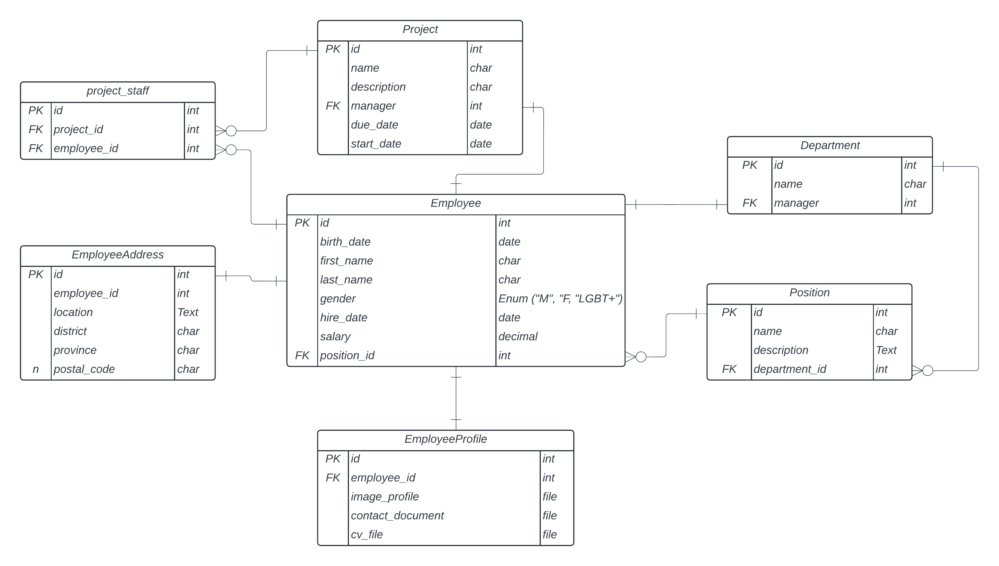
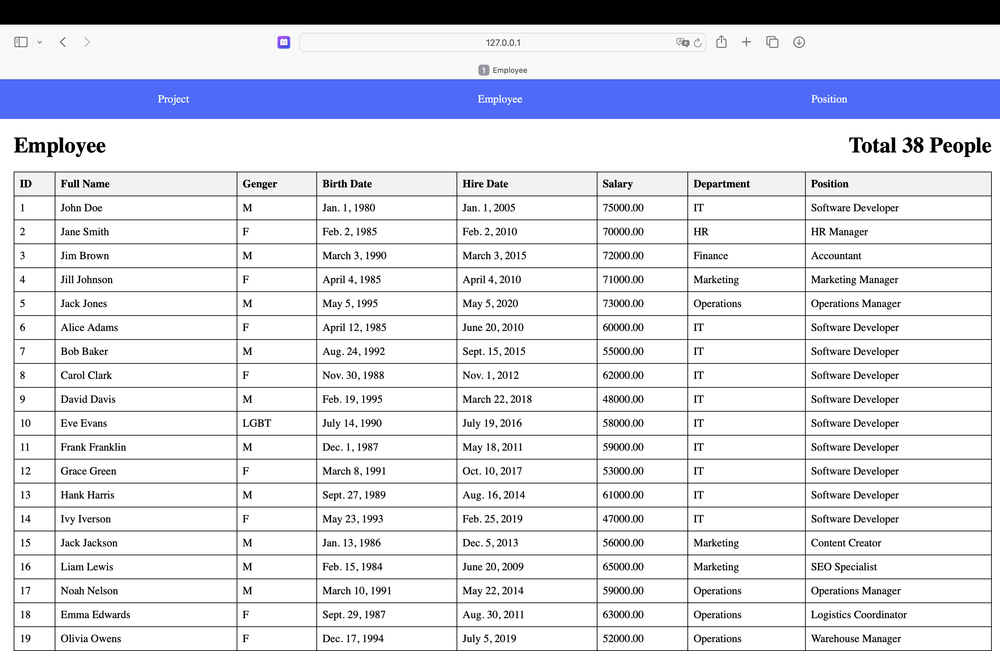
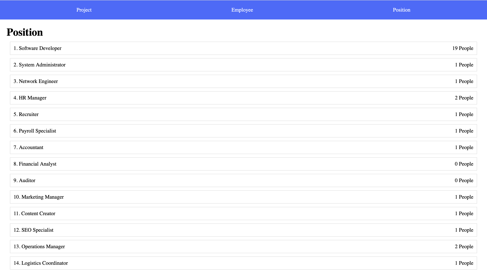
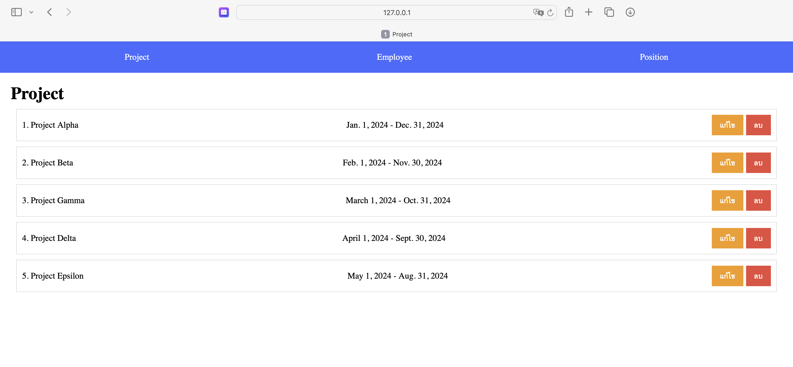
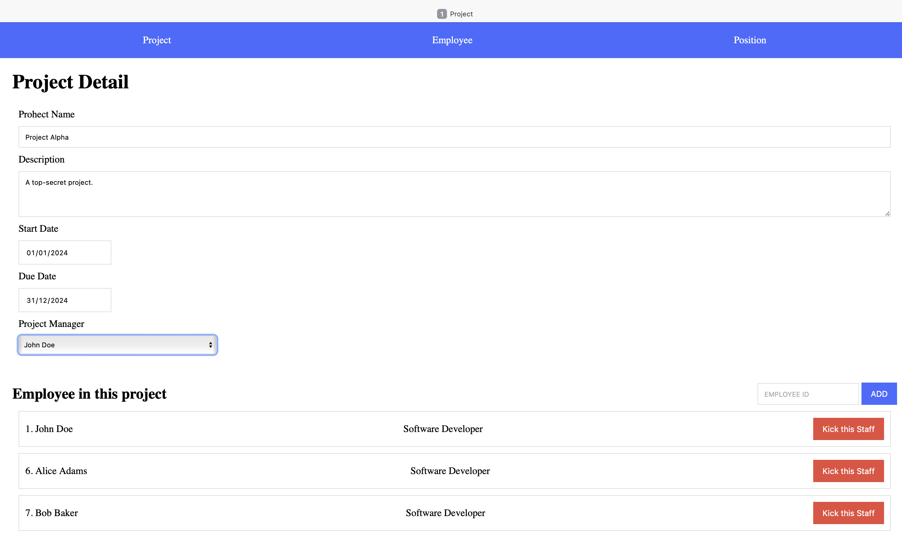

# WEEK 7 EXCERCISE


1. สร้าง project ชื่อ `employee_management`
2. สร้าง database ใหม่ชื่อ `employee_db`
4. ให้ทำการ startapp ชื่อ `employee`
5. ให้ copy code ข้างล่างไปใส่ที่ไฟล์ `employee/models.py`

    ``` PYTHON
    class Employee(models.Model):
        class Gender(models.Choices):
            M = "M"
            F = "F"
            LGBT = "LGBT"
            
        first_name = models.CharField(max_length=155)
        last_name = models.CharField(max_length=155)
        gender = models.CharField(max_length=10, choices=Gender.choices)
        birth_date = models.DateField()
        hire_date = models.DateField()
        salary = models.DecimalField(default=0, max_digits=10, decimal_places=2)
        position = models.ForeignKey(
            "employee.Position", 
            on_delete=models.SET_NULL, 
            null=True, 
            blank=True
        )
        
        def get_full_name(self):
            return f"{self.first_name} {self.last_name}"

    class EmployeeAddress(models.Model):
        employee = models.OneToOneField("employee.Employee", on_delete=models.PROTECT)
        location = models.TextField(null=True, blank=True)
        district = models.CharField(max_length=100)
        province = models.CharField(max_length=100)
        postal_code = models.CharField(max_length=15)
        
        
    class Department(models.Model):
        name = models.CharField(max_length=155)
        manager = models.OneToOneField(
            "employee.Employee", 
            on_delete=models.SET_NULL, 
            null=True, 
            blank=True
        )
        
    class Position(models.Model):
        name = models.CharField(max_length=155)
        description = models.TextField(null=True, blank=True)
        department = models.ForeignKey(
            "employee.Department",
            on_delete=models.SET_NULL, 
            null=True, 
            blank=True
        )

    class Project(models.Model):
        name = models.CharField(max_length=255)
        description = models.TextField(null=True, blank=True)
        manager = models.OneToOneField(
            "employee.Employee", 
            on_delete=models.SET_NULL, 
            null=True, 
            blank=True,
            related_name="project_mamager"
        )
        due_date = models.DateField()
        start_date = models.DateField()
        staff = models.ManyToManyField("employee.Employee")
        
    ```

6. ให้ทำการ makemigrations และ migrate
7. ให้นักศึกษา run ไฟล์ employee_db.sql เพื่อ Insert ข้อมูลลง database
8. ให้นักศึกษาลากโฟลเดอร์ `templates` ใน excercise ไปไว้ที่โฟลเดอร์ `employee` ขอโปรเจคนักศึกษา
    ```
    templates/
        - employee.hmtl
        - nav.html
        - position.html
        - project_detail.html
        - project.html
    ```


## 1. แสดงผลข้อมูลใน Template

> สำหรับแบบฝึกหัดนี้ให้สร้าง View แบบ "class-based view"

 1.1 ให้นักศึกษาสร้าง View และกำหนด URL ให้แสดงข้อมูลของพนักงานทั้งหมดในฐานข้อมูลในไฟล์ employee.html ตามภาพ (0.25 คะแนน)



 1.2 ให้นักศึกษาสร้าง View และกำหนด URL ให้แสดงข้อมูลของตำแหน่งงาน และแสดงจำนวนของพนักงานในไฟล์ position.html ตามภาพ (0.25 คะแนน)



 1.3 ให้นักศึกษาสร้าง View และกำหนด URL ให้แสดงข้อมูลโปรเจคทั้งหมดในไฟล์ project.html ตามภาพ (0.25 คะแนน)



 1.4 กำหนด PATH สำหรับ Navbar ของเว็บไซต์ในไฟล์ nav.html (0.25 คะแนน)

 **Hint:** ใช้ template tag "url" [Ref](https://docs.djangoproject.com/en/5.0/ref/templates/builtins/#url) 

```HTML
    <header>
        <nav>
            <!-- กำหนด path  -->
            <a href="/">Project</a>
            <a href="/">Employee</a>
            <a href="/">Position</a>
        </nav>
    </header>
```

## 2. ลบ-แก้ไข ข้อมูล

2.1. จากข้อที่ 1.3 เมื่อกดที่ปุ่ม แก้ไข จะไปหน้าเว็บที่แสดงรายละเอียดของโปคเจคในไฟล์ project_detail.html และให้แสดงข้อมูลของโปรเจคที่ต้องการแก่้ไขตามภาพ (0.25 คะแนน)



2.2 จากข้อที่ 1.3 ให้นักศึกษาเพิ่ม View สำหรับ ลบโปรเจค และไปแก้ไข url ใน function deleteProject(pro_id) ในไฟล์ project.html (0.25 คะแนน)

2.3 ต่อข้อ 2.1 ให้นักศึกษาเพิ่ม View สำหรับเพิ่มพนักงานเข้าไปใน project ด้วยการกรอก ID โดยกำหนดให้ใช้ Method `PUT` และไปแก้ไข function addStaff() ในไฟล์ project_detail.html (0.5 คะแนน)

2.4. ต่อข้อ 2.1 ให้นักศึกษาสร้าง path สำหรับเพิ่มลบพนักงานออกจากโปรเจคหลังจากกดปุ่ม Kick this Staff โดยกำหนดให้ใช้ Method `DELETE` และไปแก้ไข function removeStaff(emp_Id) ในไฟล์ project_detail.html (0.5 คะแนน)

**Hint:** สำหรับข้อ 2.2 - 2.4 เราสามารถส่ง response เป็น json ได้โดยใช้ JsonResponse

```python
from django.views import View
from django.http import JsonResponse

class MyView(View):

    def get(self, request):
        # Do what you view needs to do
        return JsonResponse({'foo':'bar'}, status=200)
```

## Demo
https://youtu.be/xIr_FoIuOks
