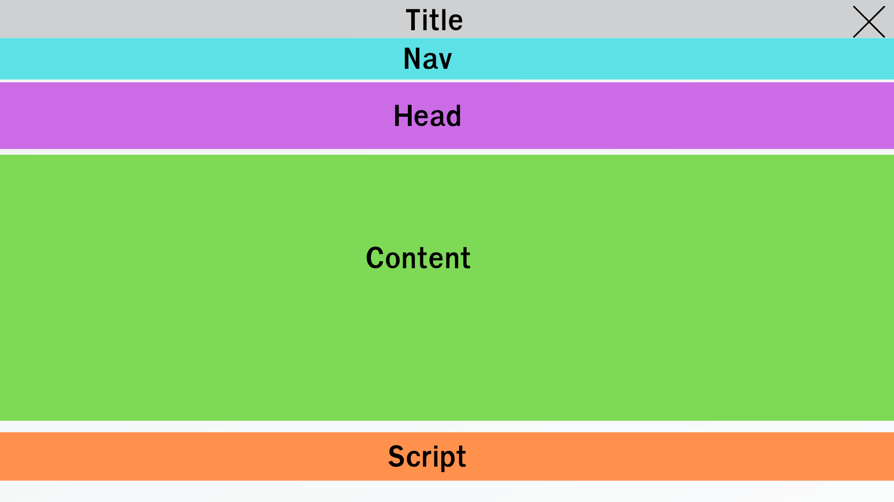
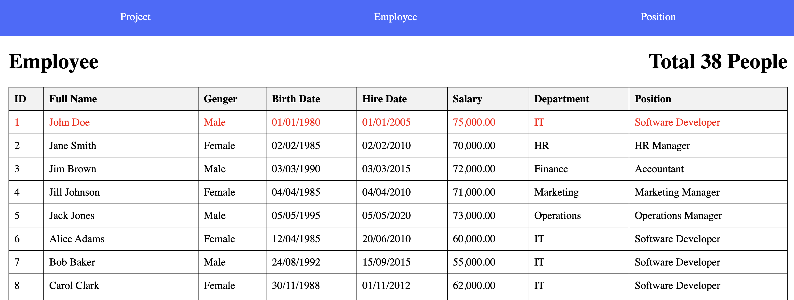

# WEEK 8 EXCERCISE


## Setup
> หากมี project ของ week 7 สามารถใช้ในการทำแบบฝึกหัดครังนี้ต่อได้ครับ (ข้ามข้อ 1-7)

1. สร้าง project ชื่อ `employee_management`
2. สร้าง database ใหม่ชื่อ `employee_db`
4. ให้ทำการ startapp ชื่อ `employee`
5. ให้ copy code ข้างล่างไปใส่ที่ไฟล์ `employee/models.py`

    ``` PYTHON
    class Employee(models.Model):
        class Gender(models.Choices):
            M = "M"
            F = "F"
            LGBT = "LGBT"
            
        first_name = models.CharField(max_length=155)
        last_name = models.CharField(max_length=155)
        gender = models.CharField(max_length=10, choices=Gender.choices)
        birth_date = models.DateField()
        hire_date = models.DateField()
        salary = models.DecimalField(default=0, max_digits=10, decimal_places=2)
        position = models.ForeignKey(
            "employee.Position", 
            on_delete=models.SET_NULL, 
            null=True, 
            blank=True
        )
        
        def get_full_name(self):
            return f"{self.first_name} {self.last_name}"

    class EmployeeAddress(models.Model):
        employee = models.OneToOneField("employee.Employee", on_delete=models.PROTECT)
        location = models.TextField(null=True, blank=True)
        district = models.CharField(max_length=100)
        province = models.CharField(max_length=100)
        postal_code = models.CharField(max_length=15)
        
        
    class Department(models.Model):
        name = models.CharField(max_length=155)
        manager = models.OneToOneField(
            "employee.Employee", 
            on_delete=models.SET_NULL, 
            null=True, 
            blank=True
        )
        
    class Position(models.Model):
        name = models.CharField(max_length=155)
        description = models.TextField(null=True, blank=True)
        department = models.ForeignKey(
            "employee.Department",
            on_delete=models.SET_NULL, 
            null=True, 
            blank=True
        )

    class Project(models.Model):
        name = models.CharField(max_length=255)
        description = models.TextField(null=True, blank=True)
        manager = models.OneToOneField(
            "employee.Employee", 
            on_delete=models.SET_NULL, 
            null=True, 
            blank=True,
            related_name="project_mamager"
        )
        due_date = models.DateField()
        start_date = models.DateField()
        staff = models.ManyToManyField("employee.Employee")
        
    ```

6. ให้ทำการ makemigrations และ migrate
7. ให้นักศึกษา run ไฟล์ employee_db.sql เพื่อ Insert ข้อมูลลง database
8. ให้นักศึกษาลากโฟลเดอร์ `templates` ใน excercise ไปไว้ที่โฟลเดอร์ `employee` ขอโปรเจคนักศึกษา
    ```
    templates/
        - employee.hmtl
        - nav.html
        - position.html
        - project_detail.html
        - project.html
    ```
9. ให้นักศึกษาลากโฟลเดอร์ `static` ใน excercise ไปใว้ในโฟลเดอร์ของโปรเจคนักศึกษา

    ```
    static/
        - style.css
        - manage_staff.js
        - project.js
    ```

## 1. Tamplate Inheritance
> นักศึกษาสามารถปรับปรุง view ของแบบฝึกหัด week7 มาใช้ร่วมกับแบบฝึกหัดครั้งนี้ได้

1.1 สร้างไฟล์ `layout.html` ในโฟลเดอร์ `templates` และกำหนด block ดังนี้ `title`, `nav`, `head`, `content`, `script` พร้อมเรียกใช้ `style.css` ในโฟลเดอร์ `static` และ include nav.html โดยจะมีโครงสร้าง Layout ของหน้าเว็บดังรูป (0.5 คะแนน)



1.2 ปรับปรุงไฟล์ html ในโฟลเดอร์ templates โดยให้ extends ไฟล์ `layout.html` และกำหนด code ภายใน block ให้เหมาะสมพร้อมแสดงผลให้ถูกต้อง (0.5 คะแนน)

1.3 ให้นักนักศึกษาเรียกใช้ static ไฟล์ใน block `script` ให้สามารถใช้งาน function ได้ถูกต้อง (0.25 คะแนน)

## 2. ปรับปรุงการแสดงผลข้อมูลในหน้าเว็บไซต์ โดยการใช้ template tag และ filter ของ django ให้ถูกต้อง

2.1 ให้นักศึกษาทำการแก้ไข URL ในทุกหน้าไปใช้ template tag `url` (0.25 คะแนน)

2.2 ในหน้า employee.html ให้ใช้ template tag `for ... empty` ในกรณีที่เป็นแถวแรก (`forloop.first`) และแถวสุดท้าย (`forloop.last`) ให้เปลี่ยนตัวอักษรเป็นสีแดง (0.25 คะแนน)

2.2 ให้นักศึกษาแสดงผลข้อมูลตารางพนักงานตามรูปภาพให้ถูกต้อง โดยให้มีการเรียงข้อมูลของพนักงานจากวันเริ่มงาน (Hire date) และแสดงผลลำดับการแสดงข้อมูลพนักงาน โดยการใช้ `filter` (0.25 คะแนน)
- Gender ถ้า M แสดง Male, F แสดง Female, Other
- วันเกิด, เริ่มงาน แสดงเป็น format 30/12/2024
- เงินเดือนทำให้แสดง comma ด้วยเช่น 1,000


